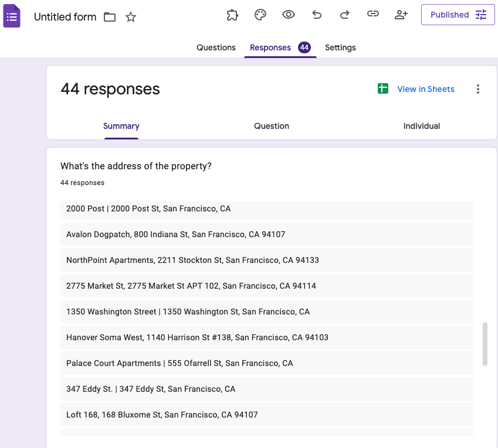
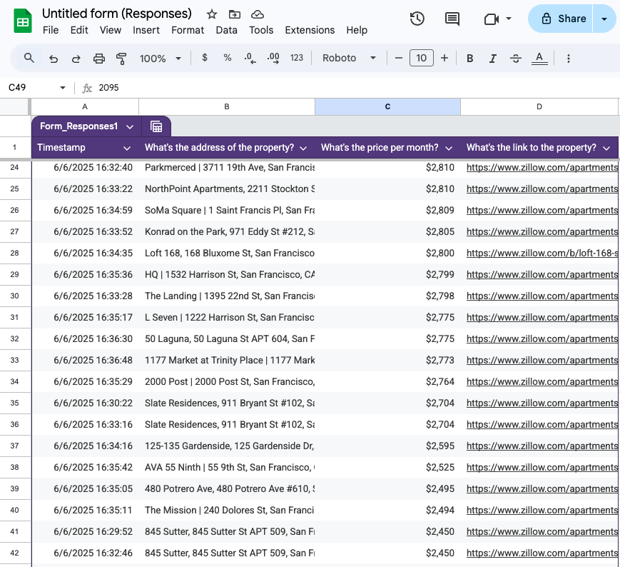

# Property Renting Bot (Data entry automation)

This Python project automates the process of collecting rental property listings from a website and submitting the data into a Google Form.
And using the Link To Spreadsheet in Google Forms, all automated data entry can be accessible for a view or further data manipulation.






## Features

- Scrapes address, price, and URL of listings using `requests` and `BeautifulSoup`.
- Uses `undetected-chromedriver` and `selenium-stealth` for data entry automation.
- Automatically fills out and submits a Google Form with the scraped data.
- Implements dynamic waits and stealth browser automation.

## Requirements & Prerequisites
- Chrome browser 
- Google forms: A form that contains questions (short answer type)
- Below Python 3.8 - 3.11 -- the above version crash with Undetected ChromeDriver
- Undetected Chromedriver & BeautifulSoup.
- For the rest, please check out the requirements.txt file.

## 📦 Dependencies

Install them with:

```bash
pip install -r requirements.txt
